# 骨鉴 · OSTEOGNOSIS

> 中国社会科学院考古研究所合作项目 · 动物骨骼智能鉴定系统

---

## 一句话介绍

骨鉴是一套面向田野考古与实验室场景的动物骨骼 AI 鉴定系统 —— 一张照片，几秒钟
就能给出物种、骨位、置信度，以及每一条证据都对得上专家特征的可审计鉴定报告。

---

## 为什么做这个

动物考古学里，种属与骨位鉴定是所有研究的第一步：判错了种属，后续对遗址生业、
驯化史、礼制结构的所有讨论都会偏。但眼下这件事的瓶颈是人：全国能独立做动物骨
骼鉴定的专家不足百人，一个中等规模遗址几千件骨片，往往要等半年才能排到手。
田野一线的考古工作者拍到照片只能先堆着，影响发掘判断的时效性。

我们把这件事用 AI 做出来了，但没把它做成黑盒：每一个判定都能告诉你「我是从哪
条专家知识得出的结论」。这样专家审核时不再要逐个重鉴，而是对着证据链点头或驳
回即可 —— 把专家从机械劳动里释放出来。

---

## 覆盖范围

- **物种** 七大类：马 · 黄牛 · 水牛 · 鹿 · 羊 · 猪 · 狗
- **骨位** 十八类：头骨 · 下颌 · 上颌 · 牙齿 · 齿式 · 寰椎 · 枢椎 · 肩胛骨 ·
  肱骨 · 桡骨 · 尺骨 · 股骨 · 胫骨 · 掌骨 · 跖骨 · 距骨 · 跟骨 · 趾骨
- **专家知识库** 74 条形态鉴定要点 + 14 条古代生态型六维档案
- **馆藏示例** 16 张马牛标本即开即用

---

## 产品长这样

### 首页：把用户引导到三步之内

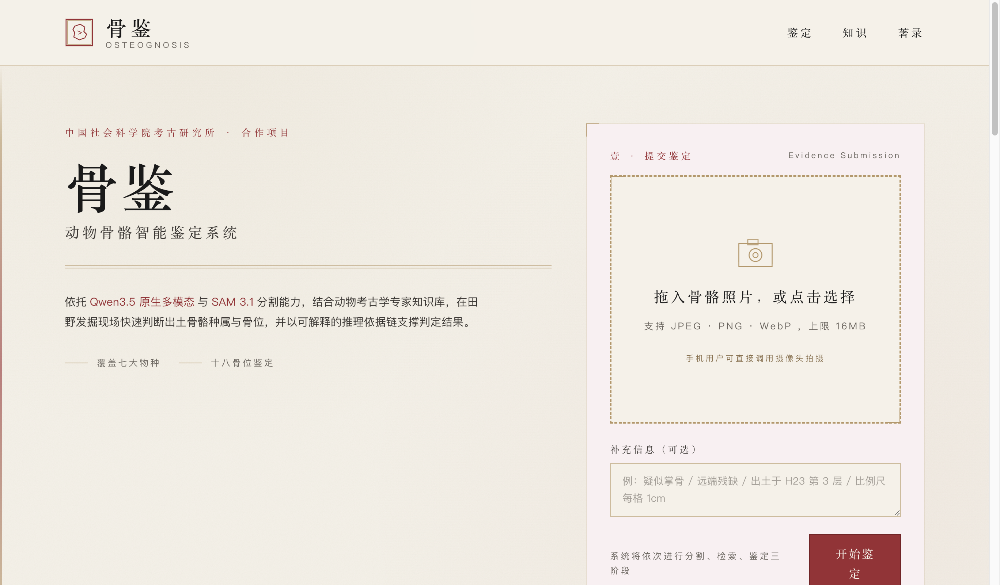

左侧是大字「骨鉴」和项目介绍，右下角是第一步提交区：拖放骨骼照片进虚线框，或者
点击选择文件，或者手机上直接调摄像头拍。顾虑到田野现场网络不稳，我们还在下面
放了 16 张预置示例 —— 评委可以点任一张直接体验完整流程，不用找图片。

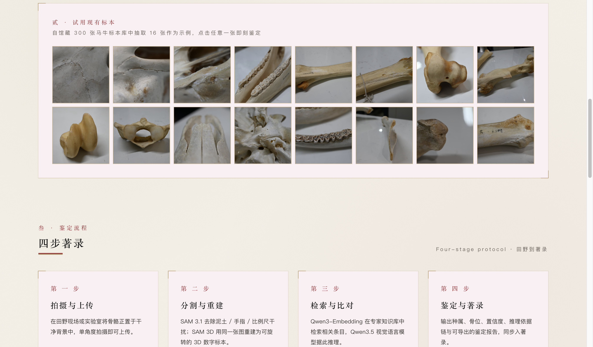

整个首页按「壹 / 贰 / 叁 / 肆 / 伍」五章铺开：提交鉴定、试用示例、鉴定流程科
普、数字标本预览、技术构成说明。版式借用中国传统典籍的章节序与朱砂版心，这套
视觉在全站统一延续。

### 鉴定结果：不是一句话，而是一份可被审核的证据

点完任意一张示例（或者自己上传的照片），系统走完「分割 → 检索 → 推理 → 重建」
四步，跳到详情页。顶部直接把结论压进一枚朱砂印章里 —— 物种、骨位、置信度一眼
看完：

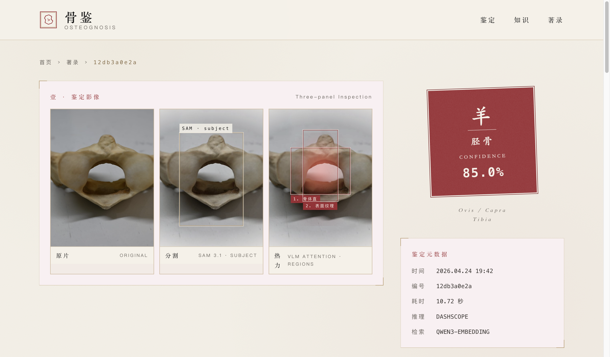

左边是三联影像：原片、SAM 分割出的主体、VLM 注意力热力图。热力图上每个朱红色
方块都标注了它对应的观察要点（「骨体直」「表面纹理」等），这是接下来证据链的
锚点。

继续往下，依次是六维度雷达评分、置信度候选排序（Ⅰ Ⅱ Ⅲ 三名）：

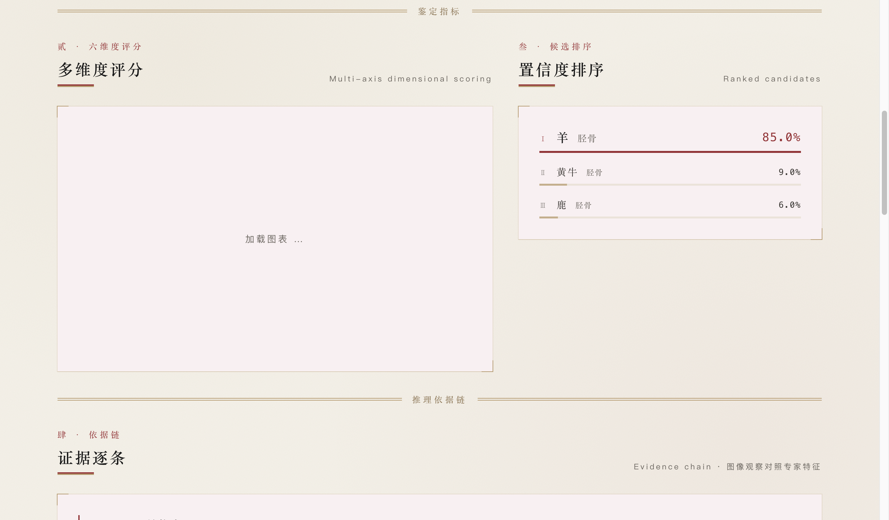

然后是整个系统最要紧的一块 —— **推理依据链**。每条证据左边写「图像观察」（模
型看到了什么），右边写「专家特征」（对应的专家条目原文），最右边是这条证据的
权重。评委要挑刺可以直接沿着这条链找分歧点：

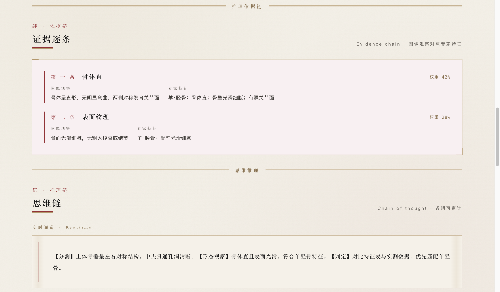

依据链下面是完整的思维推理：实时通道（快速出结果）和精推通道（深度思考，低置
信度时启用）分开写，字体做成卷轴样式，可审计：

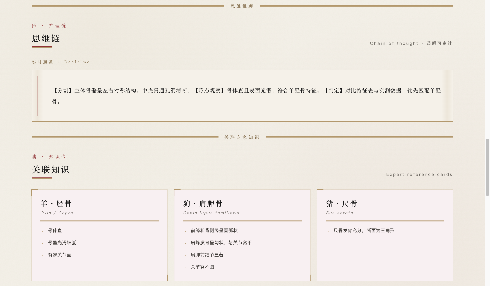

最后是根据鉴定结论实时渲染的 3D 数字标本 —— 可以拖拽旋转、滚轮缩放：

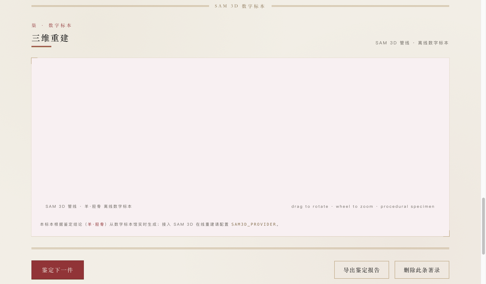

页面底部三个操作：「鉴定下一件」「导出鉴定报告」「删除此条著录」。

### 著录堂：历次鉴定归档

所有完成的鉴定自动收录到著录堂，缩略图 + 种属·骨位 + 时间 + 置信度一目了然。
点卡片回到详情页，点删除连同所有图像与 3D 一起清干净。

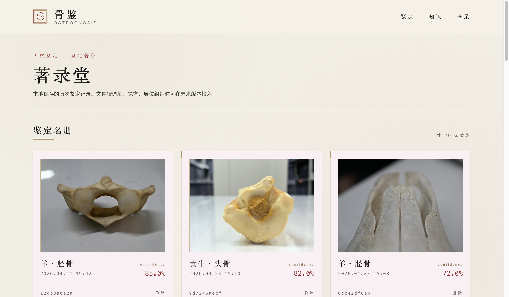

整页浏览（本次演示已有 20 条历史记录）：

### 知识图典：AI 的「课本」放在台面上

AI 不是凭空推的 —— 它能调用的全部知识都在这一页摊开给你看。两部分：

**上半 · 物种 × 骨位对照**：74 条专家鉴定要点，按骨位行、物种列展开。每一条都
是 AI 推理时能够引用的唯一证据源。

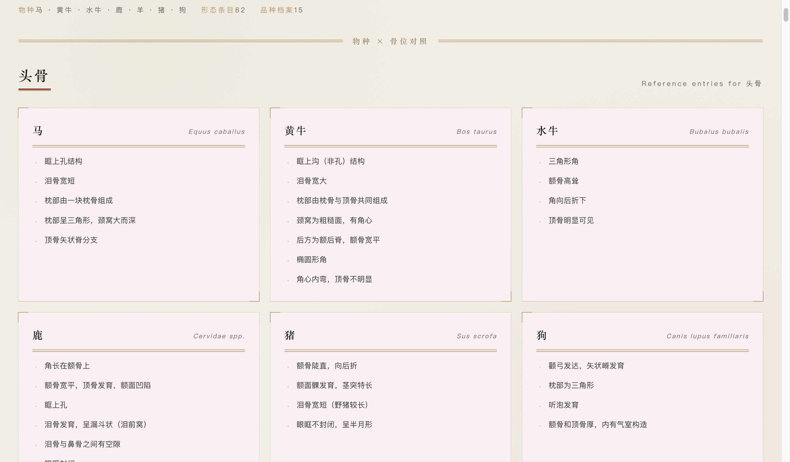

**下半 · 古代品种志 · 六维档案**：14 条古代生态型（蒙古型黄牛、华南瘤牛、汗血
马、果下马、骡……），每条展开为身世 · 遗址 · 食谱 · 职业 · 病理 · 礼制六维。
鉴定结果给出形态判定，这里给出文化语境。

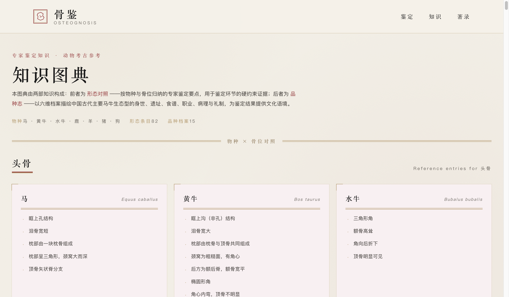

牛科汇总（黄牛 3 / 水牛 1 / 牦牛 2）：

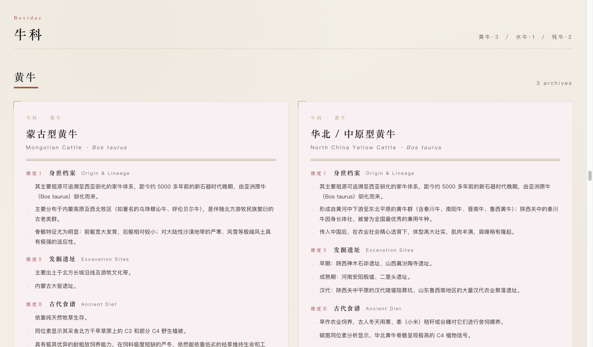

单张六维卡示例：

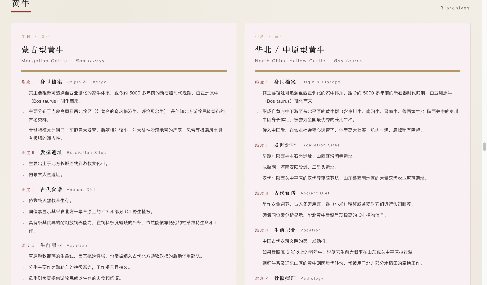

马科汇总（家马 3 / 野马 2 / 驴亚属 3 / 人工杂交种 1）：

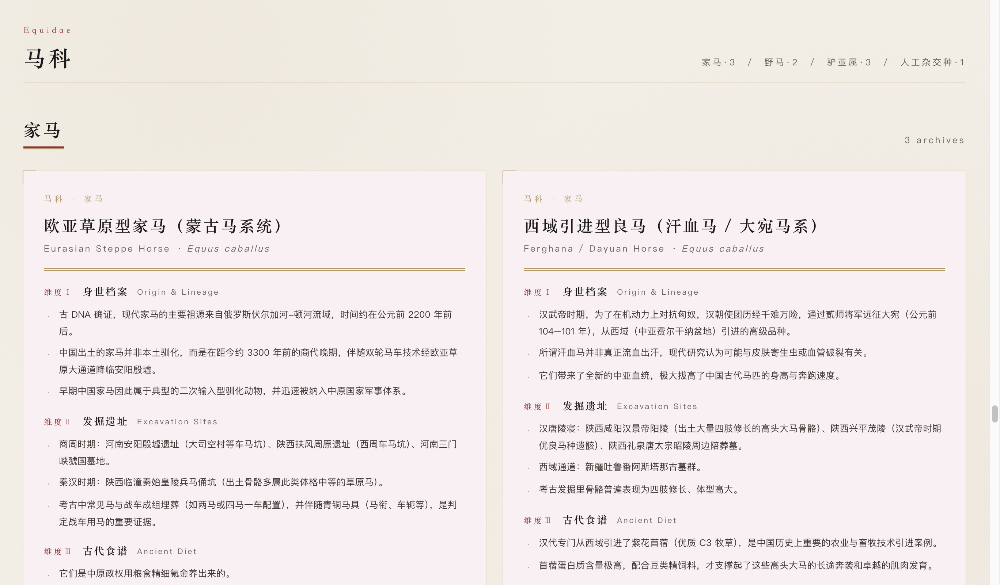

### 鉴定报告：一键导出，可打印可归档

点详情页底部的「导出鉴定报告」，进入 A4 规格的报告视图：结论、影像、候选排
序、六维评分、证据链、思维链，全部排版成可直接归档的样子，Ctrl / ⌘ + P 即可
另存为 PDF。

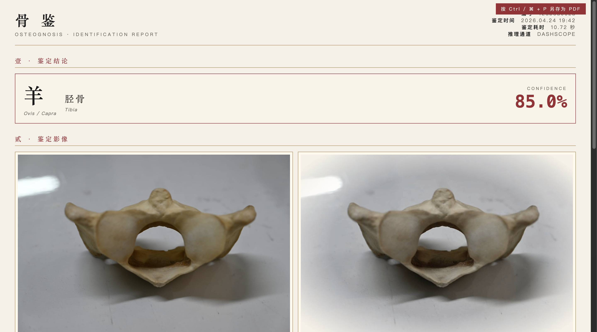

整页预览：

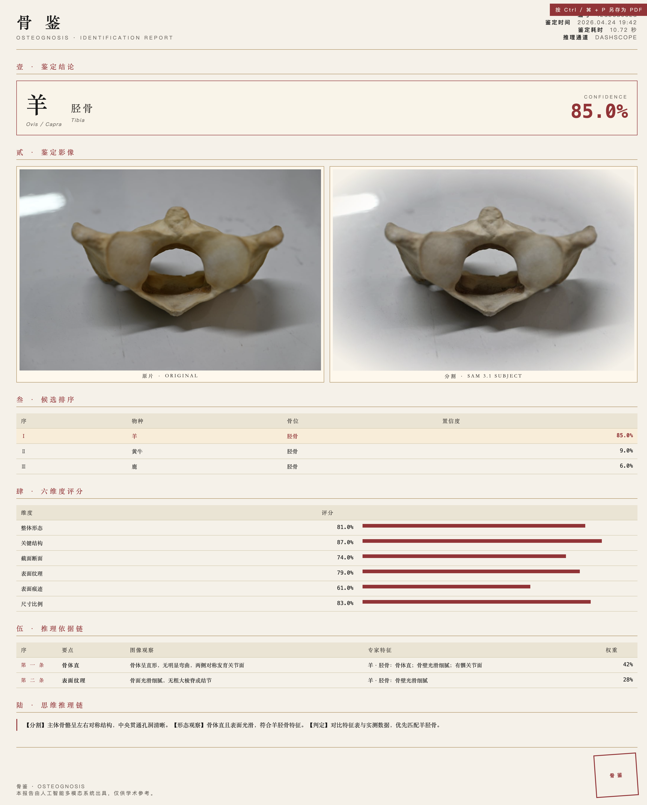

### 移动端：田野现场直接拍直接传

整站响应式，在手机上 drop zone 会自动调起后置摄像头，拍完即传即鉴定。示例
gallery 与四步流程在小屏上自动收敛为单列。

---

## 核心亮点

### 1. 可审计的 AI 鉴定

行业里把 AI 应用进考古的，大部分是黑盒 —— 输入图片、输出标签，专家根本没法用。
我们不一样：每一条结论都能逐条追溯到「模型看到了什么」和「专家知识库里的哪一
条」。评委、专家、田野考古队员，谁都能看懂，谁都能驳回。

### 2. 专家知识硬约束

我们没让 VLM 自由发挥。知识库里那 74 条形态要点是 AI 能引用证据的 **唯一**
来源；检索命中的条目作为 prompt 里的硬约束塞给模型，证据字段必须来自这些条
目才算有效。这解决了大模型「看图说话」时的瞎编问题。

### 3. 双通道推理

实时通道（Qwen3.5-Flash）秒级出结论，适合田野拍照即鉴定；置信度不足或疑似跨
物种时自动升级到精推通道（Qwen3.5-Plus Thinking），输出深度思维链供专家复核。
两通道结论同时保留，不会被一个覆盖另一个。

### 4. 数字标本

用户上传的照片在后端还会走一次 SAM 3D 单图三维重建，生成标准 .glb 网格，可以
在浏览器里直接拖拽旋转。未来接入考古数据库就是现成的数字标本馆。

### 5. 传统美学

朱砂红 · 铜褐 · 米黄纸面 · 宋体，整站做出典籍质感。这不只是好看 —— 导出的鉴定
报告看起来就是一份正式考古文书，专家拿去直接归档不违和。

---

## 技术栈

- **AI 模型**：Qwen3.5-Flash / Qwen3.5-Plus Thinking（阿里云百炼）
- **图像分割**：Meta SAM 3.1
- **三维重建**：Meta SAM 3D Objects
- **向量检索**：Qwen3-Embedding（text-embedding-v4）
- **前端**：Next.js 16 · React 19 · Turbopack
- **3D 渲染**：@react-three/fiber · @react-three/drei · three.js
- **图表**：Apache ECharts（SVG 渲染）
- **图像处理**：sharp

---

## 合作与致谢

- 中国社会科学院考古研究所
- 动物考古学实验室
- 人工智能赛道参赛作品 · 丙午年参赛版本
